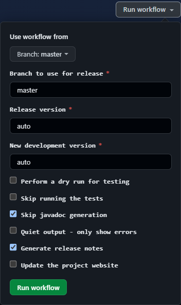

# Maven Test Project

## Maven Generated Site

The Maven generated site for this project is [here on gh-pages](https://jeremymccormick.github.io/maven-test-project/).

## Overview

This project includes a workflow defined in `.github/workflows/release.yml` for releasing a Maven project using Github Actions. The release is triggered manually by clicking on "Run workflow" under the [release workflow page](https://github.com/JeremyMcCormick/maven-test-project/actions/workflows/release.yml).



The release procedure will perform the following steps:

1. Checkout the specified branch of the project, using `master` as the default
2. Configure release versions automatically from the Maven POM file or based on user input
3. Setup authentication using SSH keys
4. Configure the Github username and email
5. Perform a Maven release and tag it
6. Automatically create a Github release page with automatically generated release notes
7. Optionally update the project's website

The release can be performed by a project collaborator who has admin privileges on the repository.

A tag is created in the repository for the release e.g. `maven-git-test-1.0.0`. The patch version in the project's `pom.xml` is automatically updated (1.0.0 -> 1.0.1-SNAPSHOT). The bin jar file will be uploaded to Nexus and should then be accessible via a public URL like [this](https://srs.slac.stanford.edu/nexus/repository/lcsim-maven2-releases/org/hps/maven-test-project/1.0.2/maven-test-project-1.0.2-bin.jar). The bin jar is also attached to the Github release page as an artifact, along with the source code. An example Github release can be found [here](https://github.com/JeremyMcCormick/maven-test-project/releases/tag/maven-test-project-1.0.15).

## Release Options

The workflow supports a number of input arguments, including the following:

| Name  | Description | Default | Notes |
| ----- | ----------- | ------- | ----- |
| branch  | git branch to use for release | master | |
| release_version | user-specified version for release (vX.Y.Z) | automatic | If provided then next dev version must also be supplied. |
| development_version | user-specified development version | automatic | This sets the next development or "SNAPSHOT" version in the POM. |
| dry_run | perform a dry run for testing which won't make the release | false | This will also skip site generation automatically. |
| skip_tests | skip running the project tests during the release | false | |
| skip_javadoc | skip generation of the project's javadoc | true | |
| generate_release_notes | automatically generate release notes for the Github release | true | |
| deploy_site | update the project's website on gh-pages after making the release | true | |
| quiet | suppress Maven output and only print errors | false | |

## Configuration

Authentication for the release is enabled using the following repository secrets and configuration options:

- A deployment key named `SSH_PUBLIC_KEY` _Settings -> Deploy keys_ which allows write access to the repository via the Github SSH protocol 
- The corresponding private key under the repository secret called `SSH_PRIVATE_KEY` which is accessed from the release workflow
- The username and password for deployment to the Maven repository, which are stored under the repository secrets `CI_DEPLOY_USERNAME` and `CI_DEPLOY_PASSWORD`, respectively

The Github username and email for commits made during the release process are set from the credentials of the user who made the release. (This can eventually be changed to a Github "bot account" with a shared email address like a mailing list.)

The source control management (SCM) information which enables SSH authentication is defined in the project's POM file as follows:

```
<scm>
    <url>git@github.com:JeremyMcCormick/maven-test-project.git</url>
    <connection>scm:git:${project.scm.url}</connection>
    <developerConnection>scm:git:${project.scm.url}</developerConnection>
    <tag>HEAD</tag>
</scm>
```

The repository credentials are passed to Maven via configuration in the file `.maven_settings.xml` in the project itself:

```
<servers>
    <server>
        <id>lcsim-repo-releases</id>
        <username>${env.CI_DEPLOY_USERNAME}</username>
        <password>${env.CI_DEPLOY_PASSWORD}</password>
    </server>
    <server>
        <id>lcsim-repo-snapshots</id>
        <username>${env.CI_DEPLOY_USERNAME}</username>
        <password>${env.CI_DEPLOY_PASSWORD}</password>
    </server>
</servers>
``` 

## Additional Workflows

The [test workflow](https://github.com/JeremyMcCormick/maven-test-project/actions/workflows/test.yml) can be used to checkout a branch, by default the current `master`, build the project, and run the tests.

The [site workflow](https://github.com/JeremyMcCormick/maven-test-project/actions/workflows/site.yml) can be used to build and deploy the project website without performing a release.

## TODO List

- Add a workflow for deploying the JARs for the current development release manually as in [this project](https://github.com/wocommunity/wonder/tree/master/.github/workflows)
- Add a Slack integration that pushes a message when releases are performed or PRs are merged
- Cleanup the management of the Maven release versions within the release workflow by using functionality in [this plugin](https://www.mojohaus.org/build-helper-maven-plugin/parse-version-mojo.html)
